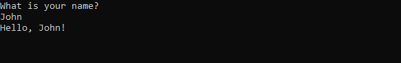

# Задание 1 по АВС
**Выполнил:** Петров Иван, БПИ195
## 1. [Hello World](https://github.com/deltareticuli/assembler_hw/blob/master/task_01/1_hello_world/hello_world.asm)
Hello World, куда без него?

## 2. [Приветствие пользователя](https://github.com/deltareticuli/assembler_hw/blob/master/task_01/2_greeting/greeting.asm)
Базовая программа на ввод/вывод данных с клавиатуры.

## 3. [Сумма двух чисел](https://github.com/deltareticuli/assembler_hw/blob/master/task_01/3_sum/sum.asm)
Последовательный ввод, а затем суммирование двух чисел.

## 4. [Последовательность Фибоначчи](https://github.com/deltareticuli/assembler_hw/blob/master/task_01/4_fibonacci/fibonacci.asm)
Вывод последовательности Фибоначчи заданной длины.

## 5. [Факториал](https://github.com/deltareticuli/assembler_hw/blob/master/task_01/5_factorial/factorial.asm)
Вычисление факториала заданного числа.

